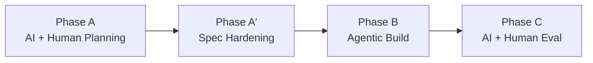

# AI + Human Agentic Workflow Template

A reusable playbook for taking a project from **AI+Human planning** through **AI-orchestrated agentic development** to **AI+Human eval**. Distilled from real planning sessions; keep project-specific history in `SESSION_LOG.md` and point this template at your doc set.

---

## Overview



| Phase | Name | Primary actors | Exit criterion |
|---|---|---|---|
| **A** | AI + Human Planning | Owner, client/stakeholders, AI (dev role) | Core doc set written; expensive forks settled; decision queue trending to zero |
| **A′** | Spec Hardening | Owner, AI (dev role) | Docs internally consistent; build stages defined; harness + task template ready |
| **B** | AI-Orchestrated Build | Orchestrator, local/cloud executor, human escalation | Stage target (e.g. V0) passes mechanical gates; owner validates by role-play |
| **C** | AI + Human Eval | CI, golden-data oracles, human gates | Milestone gates (M1, M2, …) cleared for the release slice |

**Companion artifacts** (create under your project's `docs/` unless noted):

| Artifact | Role |
|---|---|
| `PRD.md` | Requirements, roles, workflows, milestones, NFRs, **numbered decision log (D1…Dn)** |
| `ARCHITECTURE.md` | Stack, data model, pipelines, auth, security, deployment |
| `BUILD_PLAN.md` | Phased plan with acceptance criteria, dependencies, critical path |
| `EVAL_PLAN.md` | CI bar, golden-data oracles, security matrix, human eval gates |
| `DESIGN.md` | Theme, accessibility, voice (when UI matters) |
| `CONVENTIONS.md` | One-page rule sheet inlined in every task prompt |
| `INTERFACES.md` | Name registry — modules, signatures, env vars, routes; anti-drift contract |
| `PERSONA_FEEDBACK.md` | Output of persona red-team subagents + synthesis |
| `SESSION_LOG.md` | Raw session history; feeds improvements to this template |
| `task_plan_template.json` | Agentic runner task skeleton (repo root or `docs/`) |
| `tasks.json` | Canonical task plan for the current build stage |

---

## Phase A — AI + Human Planning

**Goal:** Turn an existing artifact (prototype, spreadsheet, legacy app, brief) into a spec an agent can build from — without treating a throwaway prototype as the codebase to extend.

### A1. Ingest the existing artifact

- [ ] Read everything: code, README, architecture notes, backlog, sample exports, design docs.
- [ ] Play back understanding to stakeholders **before** asking questions:
  - What the artifact proves
  - What is held together with tape
  - What assumptions are implicit
- [ ] Decide explicitly: **spec, not base** (greenfield rebuild) vs incremental extension.
- [ ] Log the session start in `SESSION_LOG.md`.

### A2. Structured discovery (small rounds)

**Rules:**
- Never more than **4 questions per round**; each round informed by the previous.
- Label every option with its **consequence**; **recommend one**.
- Settle expensive forks early (hard to retrofit later):

| Fork category | Examples |
|---|---|
| Audience / tenancy | Single-tenant per org, multi-tenant SaaS, owned deploy |
| Integrations | Where work happens vs where the app ingests |
| Deadline | Hard vs soft; what "done" means for v1 |
| Hosting / data | On-prem, cloud, student/PII posture |
| Stack | Owner's choice vs client mandate |
| v1 scope | Reports, exports, auth method, ops ownership |

- [ ] Round 1 complete: audience, tenancy, deployment model
- [ ] Round 2 complete: integrations, deadline, hosting, data posture
- [ ] Round 3+ complete: org hierarchy, v1 feature boundaries, stack

### A3. Write the four core docs (living documents)

Write in one pass from discovery; structure **for agent consumption**:

- Normative language ("must", "shall", "never")
- Acceptance criteria mapped to tests where possible
- Conventions block (stack, hard rules, definition of done)

| Doc | Minimum contents |
|---|---|
| `PRD.md` | Requirements, roles, workflows, milestones, NFRs, open questions, **decision log D1…Dn** |
| `ARCHITECTURE.md` | Stack, data model, pipelines, authorization, security, deployment |
| `BUILD_PLAN.md` | Phased tasks with ACs, dependencies, critical path |
| `EVAL_PLAN.md` | CI quality bar, golden-data oracles, security/leakage matrix, human gates |

**Living-doc rule:** Every client conversation in the same session gets folded back into **all affected docs** — not just the PRD.

- [ ] Four core docs drafted
- [ ] Decision log started (numbered, append-only; supersessions explicit)

### A4. Topic deep-dives (one feature area per conversation)

Use the same loop for each area:

1. Stakeholder states a need
2. Dev restates it as a **precise rule**
3. Structured questions only for **genuine forks**
4. Fold into all affected docs
5. Flag dev-made judgment calls for stakeholder veto

- [ ] Deep-dive 1: ___________________
- [ ] Deep-dive 2: ___________________
- [ ] Deep-dive 3: ___________________
- [ ] (add rows as needed)

### A5. Persona red-team (subagents) — highest-value step

Spawn **parallel subagents**, each role-playing one user level (e.g. end user, manager, admin, IT, compliance). Each agent:

- Reads the spec **in character**
- Returns: works / concerns / confusions / missing / questions

**Triage findings:**
- ⚙ **Dev-resolvable** → fold into docs silently
- ❓ **Client decisions** → bring to humans in the next discovery round

- [ ] Subagents spawned (one per persona)
- [ ] Findings synthesized in `PERSONA_FEEDBACK.md`
- [ ] Convergent issues prioritized (independent duplication = strong signal)

### A6. Mine the client's live artifact

Get spreadsheets, workbooks, exports, and operational docs **early** — they outrank sample data and prototype assumptions.

- [ ] Client artifact obtained and parsed
- [ ] Spec assumptions reconciled (scales, counts, vocabularies, dropdown values)
- [ ] Divergences documented (prototype vs golden master vs live workbook)

### A7. Clear the decision queue to zero

Final rounds resolve every open persona and PRD question. Log reversals in the decision log (e.g. "D24 supersedes D12") — **never silently rewrite**.

- [ ] PRD open questions empty or explicitly deferred with owner
- [ ] All persona ❓ items resolved or deferred with rationale
- [ ] Key decisions snapshot appended to `SESSION_LOG.md`

### Phase A — Human action items (template)

Track outstanding owner/client work that blocks build or eval:

1. ___________________
2. ___________________
3. ___________________

---

## Phase A′ — Spec Hardening

**Goal:** Make the spec *consistent*, *buildable in stages*, and *machine-runnable* before authoring `tasks.json`.

### A′1. Consistency sweep

- [ ] Grep every decision ID (D1…Dn) and every cross-reference
- [ ] Fix superseded-but-not-updated claims across **all** docs
- [ ] Confirm v1 requirements are not simultaneously listed as non-goals or v2 backlog

### A′2. Re-verify claims against real artifacts

- [ ] Re-parse client workbook / export / golden file
- [ ] Correct wrong facts the spec asserted (row counts, rating scales, field names)
- [ ] Document intentional divergences (e.g. prototype bug vs spec truth)

### A′3. Stage restructure (e.g. V0 / V1)

Split so work proceeds without external blockers:

| Stage | Typical contents |
|---|---|
| **Early (e.g. V0)** | Core product on fallback paths (CSV import, local login); fake/demo data; multi-role by role-play; no production IT dependencies |
| **Later (e.g. V1)** | Production integrations (SSO, LMS, etc.), ops hardening, release security; carries external milestone gates |

**Rule:** Everything buildable without client IT goes in the early stage.

- [ ] BUILD_PLAN restructured with explicit stage boundaries
- [ ] Critical path to hard deadline still visible

### A′4. Demo seed — designed, not randomized

- [ ] Demo data routes through the **real ingestion path** (same pipeline as production)
- [ ] Rows engineered to exercise features: trends, declines, collection gaps, small-n, cross-listing, aggregations
- [ ] Demo vs release quality labeled in docs

### A′5. Agent-facing doc minimization

The executor reads **inlined slices**, not whole doc trees.

- [ ] `CONVENTIONS.md` — stack, hard rules, definition of done, acceptance-check protocol
- [ ] `INTERFACES.md` — module homes, service signatures, env vars, routes, locked JSON/API shapes
- [ ] Resisted doc proliferation (no duplicate decision files, route registries, etc.)
- [ ] Decision log stays in `PRD.md` § decision log

### A′6. External AI critique as checklist

Run one or more external model reviews; **triage**, don't obey blindly.

| Item | Action | Rationale |
|---|---|---|
| | Apply / Reject | |

- [ ] Real gaps applied to docs
- [ ] Over-engineering rejected with documented reasons

### A′7. Task-plan template + harness design

Align `task_plan_template.json` to your runner before building real tasks.

**Harness principles:**

| Role | Rule |
|---|---|
| **Orchestrator** | Never executes code; never reads file contents; only evaluates `checks` |
| **Executor** | One model session per task; blind to prior task outputs where required |
| **Escalation** | Local model → cloud repair → **human** (notification, not auto-premium) |
| **Premium models** | Human-authorized, rare |
| **Gates** | Mechanical only: `file_exists`, `command` (exit 0), `manual_review` |
| **Intent** | `acceptance_criteria` is human context on escalation — **not** auto-evaluated |

**Task archetypes** (from `task_plan_template.json`):

| Archetype | Purpose | Typical gate |
|---|---|---|
| `scaffold` | Config / structure | `file_exists` |
| `write_test` | Test-first 1a | `file_exists` (test may fail until 1b) |
| `implement` | Blind implement 1b | `command` (run test) |
| `wire` | Integrate modules | `command` |
| `review` | Multi-file audit | `command` |
| `polish` | Consistency pass | `command` + `manual_review` |

- [ ] `task_plan_template.json` genericized for this project
- [ ] Runner config documented (models, context limits, command allowlist)
- [ ] Response contract: `complete` or `blocked` with specific reason — no improvisation

### Phase A′ — Human action items (template)

1. Confirm executor model tags / context settings (`max_file_chars`, `num_ctx`)
2. ___________________
3. ___________________

---

## Phase B — AI-Orchestrated Build

**Goal:** Author `tasks.json` from `BUILD_PLAN.md` and run the harness until the stage target is green.

### B1. Decompose ~10×

BUILD_PLAN tasks (T0.1, T1.3, …) are human-readable, not agent-sized.

- [ ] Explode each into atomic **test-first 1a/1b pairs**
- [ ] Each task small enough for your tier-1–3 executor comfort zone
- [ ] Tasks still tier-4+ after splitting: set `routing.primary` to `cloud_repair` or escalate to human

### B2. Harness first

The **first packet** must stand up a runnable test harness. Until it is green, every `command` gate fails on *setup*, not code — and the runner will misread that as implementation failure.

Typical first-packet contents:

- [ ] Project scaffold (framework, settings split)
- [ ] Test DB strategy (e.g. `pytest --create-db`)
- [ ] Test factories / fixtures
- [ ] `make check` or equivalent one-command verify

### B3. Test-first, stateless, blind

| Step | Task | Gate | Context rule |
|---|---|---|---|
| **1a** | `write_test` | `file_exists` | Test file created; not required to pass yet |
| **1b** | `implement` | `command` | Implementer **blind** to test file; spec + `INTERFACES.md` must fully define the interface |

Independent API calls prevent cross-task gaming. The real fragility is **plan gaps**, not model honesty — under-specified tasks get papered over unless `writes_must_be_in_target_files` and loud `blocked` status are enforced.

### B4. Prompts carry the spec

- [ ] Inline the exact slice (or load bounded sections within context limits)
- [ ] Pull all names and signatures from `INTERFACES.md`
- [ ] Include `CONVENTIONS.md` in every task
- [ ] End every prompt with the response-contract line from the template

### B5. Escalation legibility

Tag each escalation:

| Tag | Meaning | Response |
|---|---|---|
| **model-miss** | Capable plan, weak execution | Retry / cloud repair |
| **plan-gap** | Under-specified task | Sharper prompt, new task, or doc fix |

- [ ] One canonical `tasks.json` in the repo
- [ ] Plan-gaps folded back into `BUILD_PLAN.md` / `INTERFACES.md` same session

### B6. Suggested build order

1. Harness packet (green `make check`)
2. Cleanest oracle first (e.g. golden CSV parse — test 1a → implement 1b)
3. Models and services inward
4. Wire UI / integration tasks
5. Demo polish (early stage) vs release hardening (later stage)

### Phase B — Session log checkpoints

After each build window, append to `SESSION_LOG.md`:

- Tasks completed / blocked
- Escalation counts by tag (model-miss vs plan-gap)
- Runner tuning changes
- Handoff to next window

---

## Phase C — AI + Human Eval

**Goal:** Prove the stage meets the quality bar in `EVAL_PLAN.md` before promoting to the next stage or release.

### C1. Mechanical CI gates

- [ ] Unit / integration tests per `CONVENTIONS.md`
- [ ] Lint, type check, security scan as defined
- [ ] All `tasks.json` command gates still pass on clean checkout

### C2. Golden-data oracles

- [ ] Fixture pairs with known-good outputs (stakeholder picks or approves fixtures)
- [ ] Two-oracle pattern where useful: synthetic fixtures + client export subset

### C3. Security / leakage matrix

- [ ] PII confinement rules exercised
- [ ] Auth boundary tests (role × route × data scope)
- [ ] No credential / token leakage in logs or fixtures

### C4. Human eval gates

Define milestone gates in `EVAL_PLAN.md` (e.g. M1 = faculty-facing, M2 = leadership). Each gate:

- [ ] Scripted scenarios per persona
- [ ] Pass/fail criteria tied to PRD workflows
- [ ] Owner role-plays all roles for early stage (e.g. V0) before external demo

### C5. Persona re-run (optional)

Before a release slice, re-spawn persona subagents against the **built** system (or updated spec + screenshots). Cheaper than post-release UAT for requirements gaps.

---

## Cross-cutting methods

Keep these visible in every session; add new ones to `SESSION_LOG.md` → promote here when proven.

1. **Read everything before asking; play back first.**
2. **≤4 questions per round**; consequences labeled; recommend one option.
3. **Numbered decision log**; later decisions explicitly supersede earlier ones.
4. **Dev makes reversible judgment calls**; only genuine forks go to clients.
5. **Persona subagents** = cheapest pre-build UAT.
6. **Client's living artifact** > described process > prototype sample data.
7. **Docs for agents:** normative voice, ACs that name their tests, containment rules ("nothing outside X parses Y").
8. **Drift sweep** before build: grep decision IDs + cross-refs.
9. **Demo data** through the real pipeline, designed per feature — never random fill.
10. **External critique** = triage checklist, not orders.
11. **Executor reads inlined slices;** `INTERFACES.md` lets blind tasks agree on names.
12. **One canonical copy** of every file — allergic to two sources of truth.

---

## SESSION_LOG.md — per-window template

Copy this block at the start of each planning or build window.

```markdown
## Window N — <short title>

**Project:** <name>
**Session:** Chat window N, <date> — <focus>
**Participants:** <names and roles>
**Purpose:** <what this window must produce>

### What Was Produced / Changed

| Artifact | Status | Content |
|---|---|---|
| | new / edited | |

### Workflow Steps (this window)

1. ...
2. ...

### Key Decisions (this window)

- ...

### Reversed / Refined From Prior Windows

- ...

### Human Action Items

1. ...

### Methods Worth Templating

- ...

### Handoff → Window N+1

**Goal:** ...

**Current state:** ...

**Nothing blocks starting window N+1 if:** ...
```

---

## Quick reference — one page

```
PLANNING (Phase A)
  ingest → discover (≤4 Q/round) → 4 core docs → deep-dives
  → persona red-team → mine live artifact → decision queue = 0

HARDENING (Phase A′)
  drift sweep → re-verify artifacts → stage split (V0/V1)
  → designed demo seed → CONVENTIONS + INTERFACES
  → external critique checklist → task_plan_template.json

BUILD (Phase B)
  decompose 10× → harness first → 1a write_test → 1b blind implement
  → mechanical gates only → tag escalations → one tasks.json

EVAL (Phase C)
  CI → golden oracles → security matrix → human gates M1/M2
```

---

## Reference

This template was extrapolated from `40_Operations/SESSION_LOG.md` (Assessment & Accreditation Platform planning sessions, 2026-06-10/11). Update this file when the session log surfaces new reusable methods; keep project-specific decisions in the project `docs/PRD.md` decision log only.
